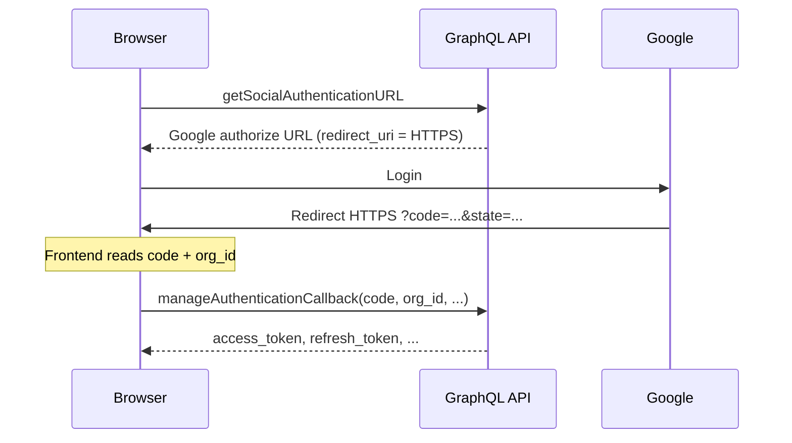
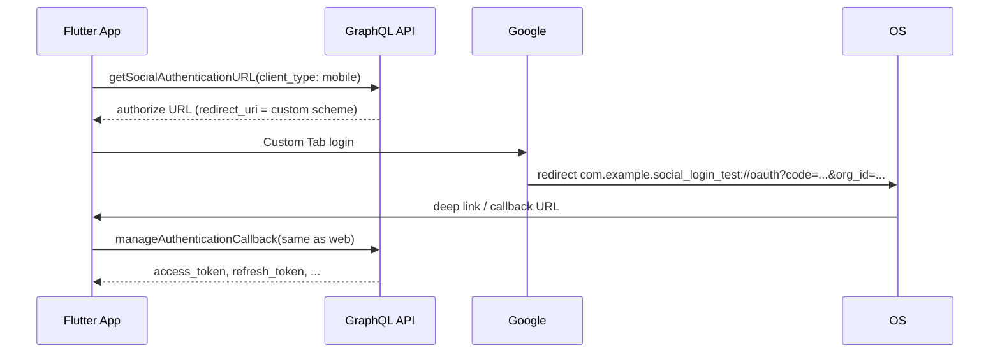

# Google Social Login — Web vs Mobile

This document describes **what already exists**, **what the Flutter app already implements**, and **what must be added (mostly backend)** so mobile receives the same `access_token` / `refresh_token` as web.

**Audience:** Backend, mobile, DevOps  
**API base (dev):** `https://api.dev.gain.io/graphql`

---

## 1. Summary

| Layer | Web (today) | Mobile (today) | Mobile (target) |
|-------|-------------|----------------|-----------------|
| Get OAuth URL | `getSocialAuthenticationURL` | Same query | Same + `client_type: mobile` |
| User signs in with Google | Browser redirect | Custom Tab (`flutter_web_auth_2`) | Same |
| OAuth redirect target | `https://{sub_domain}.gain.io/oauth` (or similar) | Same HTTPS URL → **stuck in browser** | `com.example.social_login_test://oauth?...` |
| Exchange code for tokens | `manageAuthenticationCallback` | Not reached (no `code` in app) | **Same mutation as web** |
| Token storage | Web app | N/A yet | Flutter secure storage (app team) |

**Bottom line:** Token API does not need a new mutation. Backend must return a **mobile-specific OAuth `redirect_uri`** and ensure the redirect includes `code` + `org_id`.

---

## 2. Current flow (Web — working)



### 2.1 Query — get OAuth URL

```graphql
query GET_SOCIAL_AUTHENTICATION_URL($queryData: SocialAuthenticationURLInputType!) {
  getSocialAuthenticationURL(queryData: $queryData)
}
```

**Variables (example):**

```json
{
  "queryData": {
    "platform": "google",
    "path": "/oauth",
    "prompt": "select_account",
    "sub_domain": "rrk940284"
  }
}
```

**Response:** String — full Google OAuth authorize URL.

### 2.2 Mutation — exchange code for tokens

```graphql
mutation MANAGE_AUTHENTICATION_CALLBACK($inputData: SocialAuthenticationInput) {
  manageAuthenticationCallback(inputData: $inputData) {
    ... on SocialAuthTokensType {
      access_token
      refresh_token
      org_id
      user_id
      organization_name
      org_sub_domain
      email
      first_name
      last_name
      session_id
    }
  }
}
```

**Variables (example):**

```json
{
  "inputData": {
    "prompt": "select_account",
    "platform": "google",
    "code": "4/0AeoWuM93unoq23OPePJRCChF_qJrr6H-XHUd8WtZDDNif4Jy3M-kin5hccin8Sw-jYAZtw",
    "org_id": "b193f903-3474-40cc-a770-d1cea148faf6"
  }
}
```

**Response (example):**

```json
{
  "data": {
    "manageAuthenticationCallback": {
      "access_token": "eyJ...",
      "refresh_token": "eyJ...",
      "org_id": "b193f903-3474-40cc-a770-d1cea148faf6",
      "user_id": "7e614ee9-7d22-4059-9306-518074139cfa",
      "organization_name": "RRK940284",
      "org_sub_domain": "rrk940284"
    }
  }
}
```

---

## 3. Why mobile fails with the current web redirect

On web, after Google login the browser navigates to an **HTTPS** URL. The SPA reads `code` from the URL and calls `manageAuthenticationCallback`.

On mobile:

1. App opens Google in a **Chrome Custom Tab** (required — Google blocks embedded WebView).
2. Google redirects to the same **HTTPS** `redirect_uri`.
3. Unless **App Links / Universal Links** are fully verified, the URL stays in the browser tab.
4. The Flutter app never receives `code` → mutation never runs.

```
Web:     Google → https://...  → same browser tab → JS reads code ✓
Mobile:  Google → https://...  → Custom Tab only    → app gets nothing ✗
```

---

## 4. Target flow (Mobile)



---

## 5. What is already done (no backend change required)

### 5.1 GraphQL (reuse as-is)

| Item | Status |
|------|--------|
| `getSocialAuthenticationURL` | Used by app |
| `manageAuthenticationCallback` | Implemented in app after redirect |
| Public app token in `Authorization` header | Same as web public client |

### 5.2 Flutter app (`lib/main.dart`)

| Step | Status |
|------|--------|
| Call `getSocialAuthenticationURL` | Done |
| Open Google via `flutter_web_auth_2` | Done |
| Detect `redirect_uri` (HTTPS vs custom scheme) | Done |
| Parse `code` from callback URL | Done |
| Parse `org_id` from query or base64 `state` | Done |
| Call `manageAuthenticationCallback` | Done |

### 5.3 Platform — deep link registration

**Android** (`android/app/src/main/AndroidManifest.xml`):

| Type | Scheme | Host | Path |
|------|--------|------|------|
| App Links (optional) | `https` | `social.dev.gain.io` | `/callback` |
| App Links (optional) | `https` | `social.test.gain.io` | `/callback` |
| **Custom scheme (recommended)** | `com.example.social_login_test` | `oauth` | — |

**iOS** (`ios/Runner/Info.plist`):

- URL scheme: `com.example.social_login_test`

**Package IDs (this test app):**

| Platform | ID |
|----------|-----|
| Android | `com.example.social_login_test` |
| iOS | `com.example.socialLoginTest` |

Production apps must use their real package/bundle ID in manifest, Info.plist, backend redirect URI, and Google Console.

---

## 6. What must be added (NEW work)

### 6.1 Backend (required) — recommended approach

#### A. Extend `SocialAuthenticationURLInputType`

Add one field (name can vary):

```graphql
input SocialAuthenticationURLInputType {
  platform: String!
  path: String!
  prompt: String
  sub_domain: String!
  client_type: String   # NEW: "web" | "mobile" (default "web")
}
```

**Alternative:** optional `redirect_uri: String` for mobile only.

#### B. Behavior when `client_type === "mobile"`

| Rule | Value |
|------|--------|
| OAuth `redirect_uri` in authorize URL | `com.example.social_login_test://oauth` |
| Google redirect after login | Same URI + query params |
| Web behavior when `client_type` omitted or `"web"` | **Unchanged** |

#### C. Mobile redirect URL contract

After Google login, redirect must be:

```
com.example.social_login_test://oauth?code={AUTHORIZATION_CODE}&org_id={ORG_UUID}
```

**Or** put `org_id` inside OAuth `state` (base64 JSON), as web may already do:

```json
{ "org_id": "b193f903-3474-40cc-a770-d1cea148faf6" }
```

| Query param | Required on mobile redirect |
|-------------|----------------------------|
| `code` | Yes |
| `org_id` | Yes (directly or inside decoded `state`) |

Do **not** only show an HTML success page — the native app needs the redirect URL.

#### D. `manageAuthenticationCallback`

| Change | Needed? |
|--------|---------|
| New mutation | **No** |
| Accept `code` issued for mobile `redirect_uri` | **Yes** — token exchange must use the same `redirect_uri` Google saw in step 1 |
| Same `inputData` shape | Yes |

#### E. Mobile request example (after backend change)

```json
{
  "queryData": {
    "platform": "google",
    "path": "/oauth",
    "prompt": "select_account",
    "sub_domain": "rrk940284",
    "client_type": "mobile"
  }
}
```

Expected: authorize URL contains  
`redirect_uri=com.example.social_login_test%3A%2F%2Foauth`  
(or production equivalent).

---

### 6.2 Google Cloud Console (required)

Add to **Authorized redirect URIs** for the OAuth client used by Gain:

```
com.example.social_login_test://oauth
```

For production, add each app variant, e.g.:

```
com.gain.mobile://oauth
```

Existing HTTPS redirect URIs for web stay as they are.

---

### 6.3 DevOps / Backend (only if using HTTPS App Links instead)

If backend refuses custom scheme and keeps `https://social.dev.gain.io/callback`:

| Task | Owner |
|------|--------|
| Serve `/.well-known/assetlinks.json` on callback host | Backend/DevOps |
| Include Android `package_name` + SHA-256 signing cert | Mobile provides fingerprint |
| iOS `apple-app-site-association` + Associated Domains entitlement | Mobile + DevOps |

This path is harder to maintain than custom scheme. App manifest already has HTTPS intent-filters, but **verification often fails** (Android Auth Tab error code 2) without correct `assetlinks.json`.

---

### 6.4 Mobile app (optional follow-ups)

| Task | Status |
|------|--------|
| OAuth + token exchange flow | Done in demo (`lib/main.dart`) |
| Persist tokens (`flutter_secure_storage`) | Not in demo |
| Send `client_type: "mobile"` in GraphQL variables | **Pending backend** — add when API is ready |
| Production package ID + redirect URI alignment | Before release |

Once backend ships `client_type`, update `_urlVariables` in `SocialAuthApi`:

```dart
'queryData': {
  'platform': 'google',
  'path': '/oauth',
  'prompt': 'select_account',
  'sub_domain': subDomain,
  'client_type': 'mobile',  // add this line
},
```

---

## 7. Side-by-side comparison

| | Web (current) | Mobile (required) |
|---|---------------|-------------------|
| **Input to get URL** | `sub_domain`, `platform`, `path`, `prompt` | Same + `client_type: "mobile"` |
| **OAuth redirect_uri** | `https://...` | `com.example.social_login_test://oauth` |
| **Who receives redirect** | Browser / SPA | OS → Flutter app |
| **Token API** | `manageAuthenticationCallback` | **Identical** |
| **Google Console** | HTTPS URIs registered | **Add** custom scheme URI |

---

## 8. Acceptance criteria

Backend / mobile sign-off when all are true:

- [ ] `getSocialAuthenticationURL` with `client_type: "mobile"` returns an authorize URL whose `redirect_uri` is the app custom scheme.
- [ ] On a physical device, after Google login, the app opens and logs show callback URL with `code`.
- [ ] Callback includes `org_id` (query or `state`).
- [ ] `manageAuthenticationCallback` with that `code` and `org_id` returns `access_token` and `refresh_token` (same shape as web).
- [ ] Web login with `client_type: "web"` or omitted still works.
- [ ] Custom redirect URI is registered in Google Cloud Console.

---

## 9. Checklist by team

### Backend

- [ ] Add `client_type` (or mobile `redirect_uri`) to `SocialAuthenticationURLInputType`
- [ ] Branch OAuth URL builder: web → HTTPS, mobile → custom scheme
- [ ] Ensure Google redirect includes `code` + `org_id` (or `state` with `org_id`)
- [ ] Token exchange accepts mobile `redirect_uri`
- [ ] Document prod vs dev redirect URIs

### DevOps

- [ ] Register mobile redirect URIs in Google OAuth client
- [ ] (Optional) `assetlinks.json` if using HTTPS App Links

### Mobile

- [x] `flutter_web_auth_2` + deep links in Android/iOS
- [x] Parse callback + call `manageAuthenticationCallback`
- [ ] Add `client_type: "mobile"` when API is live
- [ ] Secure token storage + auth state (production app)
- [ ] Align production `applicationId` / bundle ID with backend redirect URI

---

## 10. One-paragraph ask for backend

> Web already uses `getSocialAuthenticationURL` and `manageAuthenticationCallback` to get JWT tokens. Mobile will use the **same mutation**; the only gap is OAuth redirect. Please add `client_type: "mobile"` to `getSocialAuthenticationURL` so the authorize URL uses `redirect_uri=com.example.social_login_test://oauth` (register in Google Console), and after Google login redirect to that URI with `code` and `org_id`. No new token endpoint is required.

---

## 11. References in this repo

| File | Purpose |
|------|---------|
| `lib/main.dart` | Full mobile OAuth + token exchange demo |
| `android/app/src/main/AndroidManifest.xml` | Deep link intent-filters |
| `ios/Runner/Info.plist` | iOS URL scheme |
| `pubspec.yaml` | `flutter_web_auth_2`, `dio` |

---

*Last updated: aligned with `social_login_test` demo app — package `com.example.social_login_test`.*
